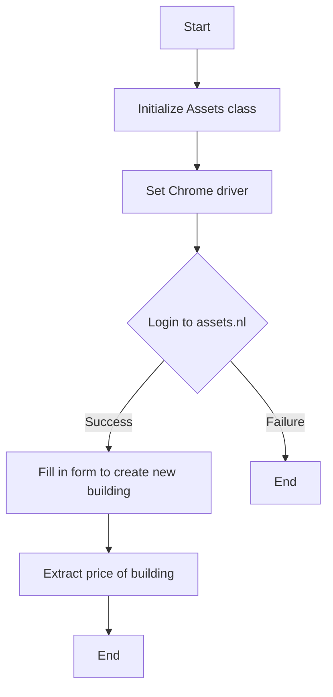

## Assets.nl Scrapper

This repository contains a Python script for interacting with the assets.nl website. It automates the process of logging in, filling in a form to create a new building, and extracting the building's price.


---

### Requirements

- Python 3.x
- Selenium Webdriver
- Google Chrome (or any Chromium-based browser)

### Setup

1. Clone the repository using Git:
   ```bash
   git clone https://github.com/concaption/assets-nl-scrapper.git
   ```
2. Navigate to the project directory:
   ```bash
   cd assets-nl-scrapper
   ```

3. Run the setup script:
   ```bash
   make setup
   ```


### Usage

1. Ensure you have the necessary credentials for assets.nl (email and password).

2. Modify the script parameters as needed (e.g., house number, zipcode, rental income).

3. Run the script:
   ```bash
   make run
   ```

The script will log into assets.nl, navigate to the necessary pages, fill in the specified form, and finally extract and print the price of the building.


### Contributing

If you wish to contribute to this project, please feel free to fork the repository and submit your pull requests.

### License

This project is licensed under the MIT License - see the LICENSE file for details.

### Acknowledgements

Thanks to the Selenium community and all contributors to this project.

---

For more information or if you encounter issues, please open an issue in the GitHub repository.